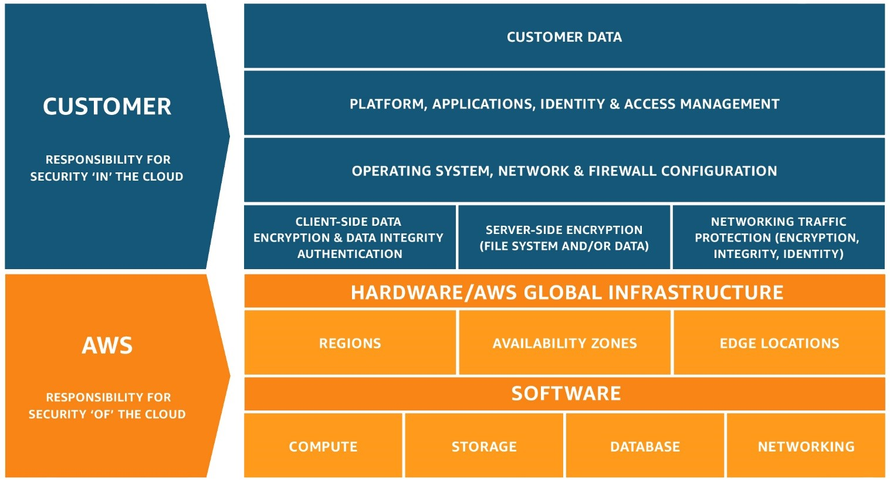

## AWS Developer Associate (2020)

 - [Information](https://aws.amazon.com/certification/certified-developer-associate/)
 - [Exam Guide](https://d1.awsstatic.com/training-and-certification/docs-dev-associate/AWS_Certified_Developer_Associate-Exam_Guide_EN_1.4.pdf)
 - [Certification Preparation](https://aws.amazon.com/certification/certification-prep/)
 - [Assessment Test in Study Guide](https://www.amazon.com/Certified-Developer-Official-Study-Guide/dp/1119508193)
 - [Amazon Resource Names](https://docs.aws.amazon.com/general/latest/gr/aws-arns-and-namespaces.html)
    - Structure: `arn:<partition>:<service>:<region>:<account-id>:(<resourceType>/)<resource>`
        - Partition is usually `aws`. For some region, such as China, this can be different
        - Some values can be omitted if not limited (by region or account)
    - `arn:aws:polly:us-west-2:123456789012:lexicon/awsLexicon`
    - `arn:aws:iam::123456789012:user/carla`
    - `arn:aws:s3:::bucket-name/exampleobject.png`
 
#### Table of Contents
 - [Deployment (22%)](#deployment)
    - [Elastic Beanstalk](#elastic-beanstalk)
    - [Cloud Formation](#cloud-formation)
    - [Serverless Application Model](#serverless-application-model-sam)
    - [Code](#code)
 - [Security (26%)](#security)
    - [Identity Access Management](#identity-access-management-iam)
    - [Security Token Service](#security-token-service-sts)
    - [Cognito](#cognito)
    - [Key Management Service](#key-management-service-kms)
    - [CloudHSM](#cloudhsm-hardware-security-modules)
    - [Virtual Private Cloud](#virtual-private-cloud-vpc)
    - [Encryption](#encryption)
 - [Development with AWS Services (30%)](#development-with-aws-services)
    - [Elastic Cloud Compute](#elastic-compute-cloud-ec2)
    - [Elastic Block Storage](#elastic-block-storage-ebs)
    - [Elastic Load Balancer](#elastic-load-balancer-elb)
    - [Simple Storage Service](#simple-storage-service-s3)
    - [CloudFront](#cloud-front)
    - [Relational Database Service](#relational-database-service-rds)
    - [ElastiCache](#elasticache)
    - [DynamoDB](#dynamodb)
    - [Lambda](#lambda)
    - [API Gateway](#api-gateway)
    - [Step Functions](#step-functions)
    - [Single Queue Service](#single-queue-service-sqs)
    - [Simple Notification Service](#simple-notification-service-sns)
    - [Simple Email Service](#simple-email-service-ses)
    - [Kinesis](#kinesis)
    - [Containers](#containers)
 - [Refactoring (10%)](#refactoring)
    - [Optimize Applications](#optimize-applications)
    - [Migration](#migration)
 - [Monitoring and Troubleshooting (12%)](#monitoring-and-troubleshooting)
    - [CloudWatch](#cloudwatch)
    - [CloudTrail](#cloudtrail)
    - [X-Ray](#x-ray)
    - [Tips](#tips)
 - [Other Services](#other-services)

#### Deployment
 - Deploy written code in AWS using CI/CD pipelines, processes and patterns
 - Deploy applications using AWS Elastic Beanstalk
 - Prepare the application package to be deployed to AWS
 - Deploy serverless applications
 
##### Axioms
 - Elastic Load Balancing and Auto Scaling are designed to work together
 - Scaling out is better than scaling up
 - AWS Elastic Beanstalk allows you to focus on building your application
 - CloudFormation templates allow you to have a definition of resources to create
 - A serverless application is typically a combination of Lambda + other AWS services

##### Elastic Beanstalk
 - For deploying and scaling web applications
    - In Java, .NET, PHP, Node.js, Python, Ruby, Go and Docker
    - On Apache Tomcat, Nginx, Passenger and IIS
 - Configure using `.config` file inside `.ebextensions` folder on top level
 - Handles
    - Deployment
    - Capacity Provisioning
    - Load Balancing
    - Auto-scaling
    - Application Health
 - Deployment Policies
    - All at once
    - Rolling
    - Rolling with additional batch
    - Immutable
 - RDB instance can be launched within Elastic Beanstalk
    - Useful for Dev and Test systems
    - Not for production, database tied to application lifecycle

##### Cloud Formation
 - Manage AWS infrastructure as code
 - Resulting resources called stack
 - Intrinsic Functions - start with (Fn:: or !) + Ref
 - Template
    - AWSTemplateFormatVersion: "2010-09-09"
    - Description
    - Metadata
    - Parameters - input custom values
    - Mappings - set values based on region, ...
    - Conditions - provision based on environment
    - Transform - include snippets of code
    - Resources (only required) - AWS resources to create
    - Outputs
 - Nested Stacks
    - Stacks create other stacks
    - Allow re-use of CloudFormation code for common use cases
    - Templates stores in S3 and referenced in resources
    - Type: `AWS::CloudFormation::Stack`
    
##### Serverless Application Model (SAM)
 - Extension of CloudFormation for serverless applications
 - Simplified syntax
 - SAM CLI
 - Template - same as CloudFormation plus:
    - Transform: AWS::Serverless-2016-10-31 (required)
    - Globals - properties common to all serverless functions and APIs
    
##### Code
 - CodeCommit - source control service
    - Code cannot be synced from S3
 - CodeBuild - build service
    - Configure using `buildspec.yml`
 - CodeDeploy - deployment service
    - Configure using `appspec.yml` or `appspec.json` (Lambda only)
    - Deploy to EC2, on-premise and lambda
    - Deployment Approaches
        - In-Place
            - stop and update, rolling update
            - only EC2 and on-premise
        - Blue/Green
            - Blue active deployment
            - Green new release
            - Elastic Load Balancer re-routes traffic
 - CodePipeline - CI and CD service

#### Security
 - Make authenticated calls to AWS services
 - Implement encryption using AWS services
 - Implement application authentication and authorization
 
##### Axioms
 - Lock down Master Account
 - Security groups only allow, NACLs allow explicit deny
 - Prefer IAM Roles to Access Keys
 

 
##### Identity Access Management (IAM)
 - User: represents person or service
    - When creating own user instead of using root
    - When other people need access, but no other identity mechanism
    - When want to use CLI, local development
 - Group: collection of IAM users
 - Role: set of permissions for users, applications or services
    - When application on EC2 needs access
    - When creating mobile apps
    - When company users want access AWS without sign in again (Active Directory)
 - Policy: defines authorization
    - Managed Policies: managed by AWS
    - Customer Managed Policies: standalone policy, managed by ourselves
    - Inline Policies: embedded within user, group or role
 - Features
    - Identity Federation - grant access without IAM users
    - Password Rotation Policy
    - Temporary Access
    - Multi Factor Authentication
    - Analyze Access
    
##### Security Token Service (STS)
 - Temporary Security Credentials
 - Configurable Credential Lifetime
 - IAM Policies to control permissions
 
##### Cognito
 - User Pools - Identity Pools
 - For Web and Mobile Applications
 - Web Identity Federation (Amazon, Facebook, Google)
 - SAML 2.0-based Federation (Microsoft Active Directory, LDAPS, Open LDAP)
 
##### Key Management Service (KMS)
 - AWS managed keys
 - Customer managed keys
 - Customer Master key
 - KMS Envelope Encryption: KMS Master Key encrypts envelope key
 - Region specific

##### CloudHSM (Hardware Security Modules)
 - Generate and use own encryption keys
 
##### Virtual Private Cloud (VPC)
 - Security Group: firewall for EC2, controlling in/out traffic
 - Network Access Control List (NACLs): firewall for subnets, controlling in/out traffic
 - Flow Logs: capture information about IP in/out traffic
 
| Security Group                        | Network Access Control List                           |
|---------------------------------------|-------------------------------------------------------|
|At instance level                      | At subnet level                                       |
|Allow rules only                       | Allow rules and deny rules                            |
|Stateful: return traffic auto. allowed | Stateless: return traffic must be explicit allowed    |
|Evaluate all rules before deciding     | Process rules in number order when deciding           |
|Applies only to instance if set        | Auto. applies to all instances of subnet              |

##### Encryption
 - Encryption on transit
    - Using SSL/TLS
    - AWS Certificate Manager (ACM)
        - Use in Load Balancing, CloudFront distributions
 - S3
    - Server-Side Encryption (AES-256) - using AWS or customer provided keys
        - Amazon S3-managed keys (SSE-S3)
        - KMS-managed keys (SSE-KMS)
        - Customer-provided keys (SSE-C)
    - Client-Side Encryption on Upload: **x-amz-server-side-encryption**
        - AES256 - SSE-S3
        - ams:kms - SSE-KMS
 - RDS
    - Encryption using AWS KMS for instance, backups and snapshots
    - Encryption on existing DB instances not supported
        - Possible with snapshot and restore as encrypted instance
    - Encryption on an instance cannot be disabled
 - AWS Encryption SDK
    - Client side encryption library
    - Encrypt and decrypt data using industry standards and best practices
    - Supports: Management of keys, encryption/decryption, storage of encrypted data

#### Development with AWS Services
 - Write code for serverless applications
 - Translate functional requirements into application design
 - Implement application design into application code
 - Write code that interacts with AWS services by using APIs, SDKs and AWS CLI
##### Axioms
 - Choose Managed Services over unmanaged services
 - Do not directly expose resources or API; use AWS edge services and API Gateway
 - Session state stored on the server is never a good architecture
 - Decouple your infrastructure

##### Elastic Compute Cloud (EC2)
 - On Demand: fixed rates by hour or seconds
    - Low cost and flexibility
    - When short term, spiky or unpredictable workloads
    - When developed or tested for first time
 - Reserved: capacity reservation, 1 or 3 year terms
    - up-front payment for reduced cost
    - When steady state or predictable usage
    - Standard RI
    - Convertible RI - change attributes of RI
    - Scheduled RI - within time window
 - Spot: bid whatever price for capacity, greater savings
    - When flexible start and end times
    - When urgent need for large amount of capacity
 - Dedicated Hosts: physical servers
    - Can be purchased on-demand or as reservation
    - When using server-bound licenses

|Family | Speciality                                | Use Case                                  
|-------|-------------------------------------------|---
| T2    | Lowest Cost, General Purpose              | Web Servers, Small Databases
| A1    | General Purpose, ARM-based workloads      | Scale-out workloads (Web Servers, Containerized Microservices)
| M5    | General Purpose                           | Application Servers
|-------|-------------------------------------------|---------------------------------------
| P3    | Graphics / General Purpose GPU            | Machine Learning, Bitcoin Mining
| G3    | Graphics Intensive                        | Video Encoding, 3D Application Streaming
| F1    | Field Programmable Gate Array             | Research, Big Data, Analytics, Real-Time Video Processing
|-------|-------------------------------------------|---------------------------------------
| H1    | High Disk Throughput                      | MapReduce-based Workloads, Distributed File Systems (HDFs/MapR-FS)
| I3    | High Speed Storage                        | NoSQL Databases, Data Warehousing
| D2    | Dense Storage                             | File Servers, Data Warehousing, Hadoop
|-------|-------------------------------------------|---------------------------------------
| R4    | Memory Optimized                          | Memory Intensive Apps / Databases
| X1    | Memory Optimized                          | SAP HANA, Apache Spark
|-------|-------------------------------------------|---------------------------------------
| C5    | Compute Optimized                         | CPU Intensive Apps / Databases

##### Elastic Block Storage (EBS)
 - General Purpose SSD (GP2) - balance price and performance
    - 3 IOPS/GiB, burst to 3.000 IOPS
    - For small/medium DBs
    - For dev and test environments
 - Provisioned IOPS SSD (IO1) - IO intensive applications
    - up to 64.000 IOPS, 1.000 MiB/s througput
 - Throughput Optimized HDD (ST1) - Big data, Data warehouses
    - For large, sequential workloads
 - Cold HDD (SC1) - infrequent access
    - For large, sequential, cold-data workloads
 - Magnetic (Standard) - infrequent access, low cost
    - Lowest cost of bootable storage
    
##### Elastic Load Balancer (ELB)
 - Application Load Balancer, Layer 7 (Application)
    - For HTTP and HTTPS
    - Application-aware and intelligent
    - Advanced request routing
 - Network Load Balancer, Layer 4 (Connection)
    - For TCP, extreme performance required
    - Handling millions of request per second
    - Ultra-low latency
 - Classic Load Balancer
    - Legacy Elastic Load Balancer
    - Layer 7, specific features (X-Forwarded or sticky sessions)
    - Can use strict Layer 4 for applications that rely purely on TCP
    
##### Simple Storage Service (S3)
 - Store any kind of files from 0 Bytes to 5 TB
 - Max PUT upload - 5 GB -> else use Multipart Upload
 - Stored across at least 3 Availability Zones (AZ)
 - Consistency Model
    - Read after Write for new PUTS
    - Eventual Consistency for overwrite PUTS and DELETE
 - Tiers: x-amz-storage-class header
    - S3
    - S3 - IA
        - Infrequent access
    - S3 - One Zone IA
        - Infrequent access in single AZ
    - Reduced Redundancy Storage
        - For data that can be recreated
    - Glacier
        - For archival only
        - Infrequent access
        - Takes 3-5 hours to restore
    - S3 - Intelligent
        - For unknown or unpredictable access pattern
        - Automatically moves to cost-effective tier
  - Security
    - Bucket Policies: permission on bucket level
    - Access Control List (ACL): permission for specific object
  - Features
    - S3 Transfer Acceleration: fast, easy and secure transfer over long distance
    - Signed Url / Cookies: For restricting viewer access
    - [Encryption](#encryption)
    - Versioning
    - Replication
    
##### Cloud Front
 - Content Delivery Network (CDN)
 - Edge Location: keep cache of object, closer geographically
 - Distribution: collection of edge locations
 
##### Relational Database Service (RDS)
 - Types: SQL Server, Oracle, MySQL, PostgreSQL, Amazon Aurora, MariaDB
 - Types of Queries
    - Online Transaction Processing (OLTP): simple queries, RDS, e.g one transaction
    - Online Analytics Processing (OLAP): complex queries, Redshift, e.g net profit
 - Backups
    - Automated Backups: Full daily snapshot, retention 1-35 days
    - Database Snapshots: Manually, stored even after RDS deletion
    - Restored as new RDS instance
    - Can be copied to other regions
 - [Encryption](#encryption)
 - Multi-AZ: Synchronous
    - Exact copy in another AZ
    - For disaster recovery
 - Read Replica: Asynchronous
    - Read-only copies
    - For read-heavy database
    - Must have automatic backups
    - Can also be in multi-AZ
    - Can be promoted to be own DB

##### ElastiCache
 - Storing critical pieces of data for low-latency
 - Between application and database
 - Strategies
    - Lazy Loading
    - Write-Through
 - Supported Engines
    - Memcached
        - Simple caching model
        - Large cache nodes and multithreaded performance
        - Scale cache horizontally
        - No Multi-AZ
    - Redis
        - Advanced data types
        - Sorting and Ranking
        - Persistence
        - Supports Master/Slave Replication
        - Run in multiple AZ with failover
  - For read-heavy, frequently-accessed data
  - For compute-heavy workload
  - For storing result of IO intensive queries
  
##### DynamoDB
 - NoSQL, document and key-value data
 - Spread across 3 geographically distinct data centers
 - Great fit for: mobile, web, gaming, ad-tech, IoT, ...
 - Supports JSON, HTML or XML
 - Consistency Model
    - Eventual Consistent Reads (default)
    - Strong Consistent Reads
 - Primary Keys
    - Partition Key: unique attribute (e.g user id)
    - Composite Key: partition + sort key (e.g timestamp)
 - Secondary Indexes
    - Local Secondary Index: created when creating table
        - Same partition key, different sort key
        - Queries faster using index
        - e.g partition: userID, sort: creation date
    - Global Secondary Index: create any time
        - Different partition and sort key
        - Speeds up queries relating to both keys
        - e.g partition: email, sort: last login date
 - Query - Find item **only** based on primary key
    - Only default, eventually consistent
    - **ProjectionExpression**: specify specific attributes
    - **ScanIndexForward**: change order, only for queries
    - Scan - examines every item in table
        - dumps entire table, then filters -> less efficient
    - Improve Performance
        - Smaller page size -> fewer reads
        - Avoid scans
        - Can configure parallel scans
 - Provisioned Throughput: **always round up**
    - 1x Write CU = 1x write of 1KB/s
    - 1x Read CU = 1x strongly / 2x eventual read of 4KB/s
    - For predictable traffic
 - On Demand Capacity
    - Pay-per-use model
    - For unpredictable traffic
 - **ProvisionedThroughputExceededException**
    - When request rate too high
    - SDK auto retries until success
    - Reduce request frequency
    - Use exponential backoff
 - Features
     - DynamoDB Accelerator: write-through caching service
        - For eventual consistent, read-heavy workloads
     - DynamoDB Streams: stream of item changes
     - Global Tables: allows Data Replication, full replication of table
     - Conditional write operations
     - Optimistic locking with version number
     - Batch Operations: BatchGetItem, BatchWriteItem
     - DynamoDB Local: install locally for testing and development
     
##### Lambda
 - Serverless compute service
 - Scales out automatically
 - Supported Languages: Java, Node.js, Python, C#, Go, Ruby, Powershell
 - Event Sources
    - Data Sources: S3, DynamoDB, Kinesis, Cognito
    - Endpoints: API Gateway, IoT, Step Functions, Alexa
    - Dev. and Management Tools: CloudFormation, CloudTrail, CodeCommit, CloudWatch
    - Event/Message: SES, SNS, SQS, Cron Events
 - Version Control
 - Layers: share code (Frameworks, SDKs, Libraries, ...) across multiple functions
    
##### API Gateway
 - API Service for REST, SOAP, Websocket
 - Features
    - Track and control usage by API key
    - Maintain multiple version of API
    - Deploy to different stages (prod, dev)
        - Stage variables: name-value pairs, like env variables for stages
    - API Caching: cache response for specific TTL period
    - API Import
        - From external file (Swagger v2.0)
        - New API by submitting POST with Swagger Definition
        - Update API by submitting PUT with Swagger Definition
    - API Throttle
        - default: steady-stage request to 10.000 requests/s
        - Max concurrent: 5000 across all APIs
        - 429 error if too many requests
    - WebSocket API
    - Authorization
        - IAM policies
        - Resource policies
        - Lambda custom authorizers
        - Amazon Cognito user pools
        
##### Step Functions
 - Visualize and test serverless applications
 - Coordinate calls between multiple lambda functions
 - Types
    - Sequential Steps
    - Branching Steps
    - Parallel Steps
    
##### Single Queue Service (SQS)
 - Pull based, active - send/receive (1 to 1)
 - Persisted, up to 256 KB any format
 - **MessageRetentionPeriod**: kept in queue 1min - 14days (default 4 days)
 - **VisibilityTimeout**: invisible for others until processed, max 12h (default 30s)
 - Long Polling: wait until message available or timeout (max 20s)
 - Short Polling: return immediately if empty
 - Standard Queues
    - nearly unlimited tx/s
    - at least once
    - best-effort ordering
 - FIFO Queues
    - limited 300 tx/s
    - delivered once, remains until processed
    - guarantees order
    - no duplicates
    - supports message groups - multiple ordered messages
    
##### Simple Notification Service (SNS)
 - Push based, passive - publish/subscribe (1 to N)
 - Not persisted
 - Topic - access point for subscription
    - Allow grouping of multiple recipients
    - Supports multiple endpoint types
 - Endpoints
    - Push Notifications
    - SMS
    - Email
    - Any HTTP
    
##### Simple Email Service (SES)
 - Scalable and highly available email service
 - Can also receive email -> S3 Bucket
 - Use Cases
    - Automated Emails
    - Purchase Confirmation, Shipping Notification, Order Status Updates
    - Marketing Communication, Advertisements, Newsletters, Special Offers
    
##### Kinesis
 - Streaming Data for easy loading and analyzing
 - Use Cases
    - Online Purchases
    - Stock Prices
    - Game Data
 - Kinesis Streams
    - Store data in shard, 24h - 7 days
    - Consists of shards
    - 5 tx/s for read, up to total 2 MB/s
    - Data capacity: number of shards
    - Total capacity: sum of shard capacity
 - Kinesis Firehose
    - automated, no shards
    - directly stored in S3 or S3 -> Redshift
    - optional analysis -> Kinesis Analytics
 - Kinesis Analytics
    - analyze streaming data,
    - gain actionable insights
    - respond to your business and customer needs in real time
    
##### Containers
 - Fargate: provision and manage servers for ECS and EKS automatically
 - Elastic Container Service (ECS): management of containerized apps
 - Elastic Kubernetes Service (EKS): management of kubernetes
 - Elastic Container Registry (ECR): repo for container images

#### Refactoring
 - Optimize application to best use AWS services and features
 - Migrate existing application code to run on AWS
##### Axioms
 - Durability and availability are not the same thing
 - Scalability and elasticity are not the same thing
 - Persistence and Amazon EC2 Instance Store do not go together
 - Migrate your monolith apps to microservices to functions
 - Go serverless
 
##### Optimize Applications
 - Where possible, automate the provisioning, termination and configuration of resources
 - Leverage the breadth of AWS services; don’t limit your infrastructure to servers
     - Anti Pattern
         - Simple applications run on persistent servers
         - Applications communicate directly with one another
         - Static web assets are stored locally on instances
         - Back-end servers handle user authentication and user state storage
     - Best Practices
         - Serverless solution is provisioned at the time of need
         - Message queues handle communication between applications
         - Static web assets are stored externally such as on Amazon S3
         - User authentication and user state storage are handled by managed AWS services
 - Avoid Single Point of Failure
     - Create secondary database server and replicate data
 - Use Caching to minimize redundant data retrieval operations
     - Use CloudFront to cache (lower latency and cost)
 
##### Migration
 - Rehost - Lift and Shift: All-in or Hybrid
 - Replatform - Lift, Tinker and Shift
 - Repurchase - Drop and Shop
 - Refactor - change code to run on cloud
     - Re-writing and decoupling applications
     - Re-architecting a solution
     - Complete refactor vs Partial refactor
 - Retain - service not moving to cloud
 - Retire - bleed off until dies

#### Monitoring and Troubleshooting
 - Write code that can be monitored
 - Perform root cause analysis on faults found in testing or production
##### Axioms
 - Always check security groups and network access control list when troubleshooting
 - Instances launched into a private subnet in a VPC can’t properly communicate with the Internet unless you use NAT
 - You need an IGW and a route in the route table to talk to the internet
 - EBS volumes are loosely coupled to EC2 instances; can attach/detach except for the boot volume
 
##### CloudWatch
 - Monitor utilization/performance of AWS resources
 - Create alarms to monitor any metrics
 - Metrics (have retention period)
    - Use standard and custom metrics
    - Default monitoring 5 min interval
    - Detailed monitoring 1 min
    - Monitoring interval can be 1, 3 or 5 min
 - Amazon CloudWatch Logs
    - Monitor Logs in near real-time for phrases, values or patterns
    - Stored indefinitely
    - Can change retention for each Log Group
 - CloudWatch Agent
    - Collect system-level metrics from EC2 or on-premise
    - Collect logs from EC2 or on-premise
    - Store and view metrics in CloudWatch
 - CloudWatch Container Insights
    - Collect, aggregate and summarize metrics and logs from containerized applications and microservices
    - For ECS, EKS and Kubernetes on EC2
 - Does not aggregate data across region

##### CloudTrail
 - Monitor API calls and tracks user activity
 - Use Case
    - Track changes to resources
    - Answer simple questions about user activity
    - Demonstrate compliance
    - Troubleshoot
    - Perform security analysis
    
##### X-Ray
 - Analyze and debug production, distributed applications
    - Create a Service Map
    - Identify errors and bugs
    - Identify performance bottlenecks
    - Build your own analysis and visualization apps
 
##### Tips 
 - Check the AWS error code returned from operations
     - 400 series: Handle error in application
     - 500 series: Retry operation
 - Collection and analysis of log data from instances such as
     - System logs
     - HTTP logs
 - Monitoring of
     - Instance health and performance
     - Availability of managed services (such as Amazon RDS)
     - Network performance
     - Utilization for cost efficiency
     - Unused or underused instances running

#### Other Services
 - AWS Secrets Manager: Rotate, manage, and retrieve database credentials, API keys, and other secrets
 - AWS AppSync: Create flexible API from one or more data sources using GraphQL, supports real-time updates
 - AWS Polly: Turn text into lifelike speech using deep learning 
 - AWS Snowball: Physically migrate petabyte-scale data sets into and out of AWS
 - AWS Snowmobile: Migrate or transport exabyte-scale data sets into and out of AWS 
 - AWS Storage Gateway: Hybrid cloud storage with local caching, on-premise access
 - AWS OpsWorks: Automate Operations with Chef and Puppet. Use code to automate the configurations of your servers
 - AWS Cost Explorer: Visualize, understand, and manage your AWS costs and usage over time
 - AWS Systems Manager: Gain operational insights and take action on AWS resources
 - Amazon Redshift: Data warehouse to analyze data using SQL or Business Intelligence (BI), **Leader Node** receive SQL queries
 - Amazon Neptune: Fast, reliable graph database built for the cloud
 - Amazon WorkDocs: Secure content collaboration, Simple Active Directory can be used for authentication
